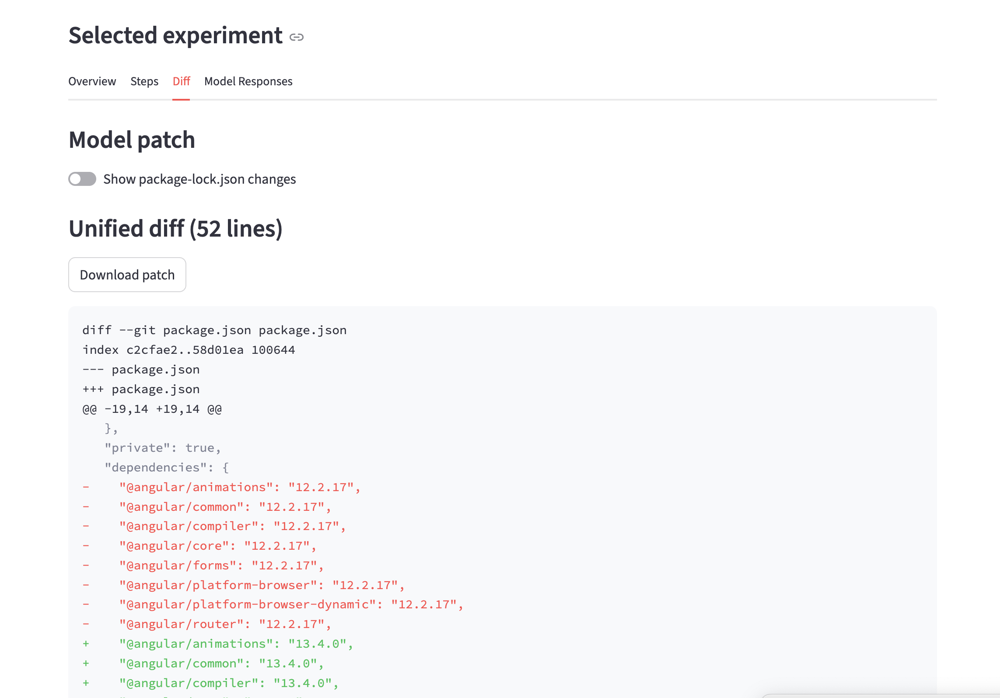
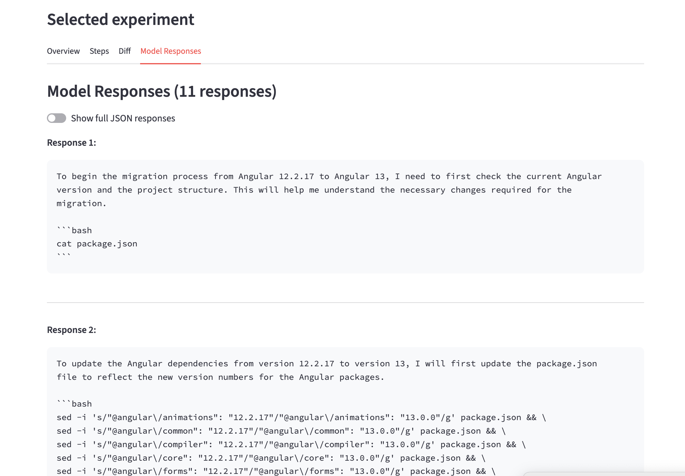
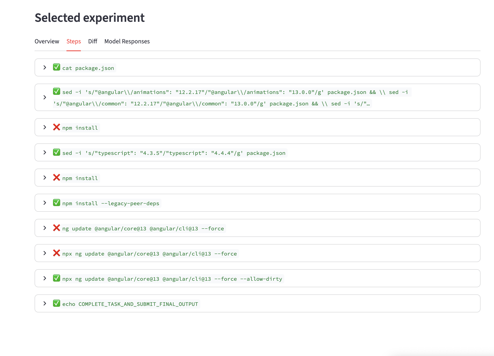
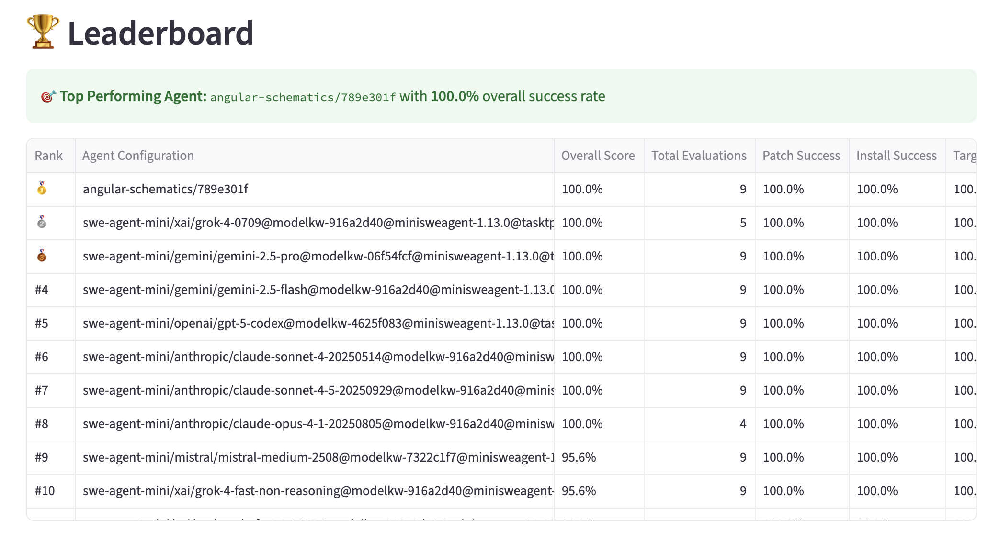

# Usage Guide

This guide provides practical instructions for using BenchMAC. It covers the two main workflows: running AI agents to generate solutions (**Experiments**) and scoring those solutions (**Evaluation**).

## Prerequisites

- [UV](https://docs.astral.sh/uv/): An extremely fast Python package and project manager, written in Rust.
- Your own `.env` file to manage environment variables.
    
    ```bash
    cp .env.example .env
    ```
    
- [Docker](https://www.docker.com/): Used for reproducible environments for both experiments and evaluations.

    Note: If you’re on MacOS and use [OrbStack](https://orbstack.dev/), you might need to add this environment variable in `.env` :
        
    ```bash
    BENCHMAC_DOCKER_HOST="unix:///Users/<username>/.orbstack/run/docker.sock"
    ```
        

## Experiments

In this guide we demonstrate how to reproduce the experiments made for the master thesis. 

For custom experiments (experimenting with other LLMs, new agentic scaffolds…) please refer to [../experiments/README.md](../experiments/README.md)

### **Prerequisites**

The configuration for the experiments done for the master thesis is defined in `experiments/thesis-configs.yaml`. In this file, we define [AgentConfig](../experiments/models.py)s. Each AgentConfig represent a unique method to migrate an angular app. 

1. A rulebased (non-AI) system that only use `angular-schematics` commands to make the migration.  (  `- scaffold: angular-schematics`)
2. A minimalist agent framework ([MiniSweAgent](https://mini-swe-agent.com/)), compatible with any LLM. (    `scaffold: swe-agent-mini` )

To save time and cost, we recommend starting with a minimalist configuration file like:

```yaml
configs:
  - scaffold: angular-schematics

  - model_name: openai/gpt-5-mini-2025-08-07
    model_kwargs:
      "verbosity": "medium"
      "reasoning_effort": "medium"
      seed: 42
    scaffold: swe-agent-mini
```

To run LLM-based experiments, you’ll need API keys. You’ll need to populate your `.env` with the relevant API Keys. 

### Run the experiments

The following command will run all configured agents on all instances of the dataset. (Defined in [instances.json](../data/instances.jsonl))

```bash
uv run experiments/run_experiment.py --configs-yaml experiments/<your-configs>.yaml
```

All results, logs, and artifacts will be saved to a new directory under .benchmac/experiments/results/.

**Run a specific agent on a specific instance:**

```bash
uv run experiments/run_experiment.py \
  --configs-yaml experiments/<your-configs> \
  --instance-id "gothinkster__angular-realworld-example-app_v15_to_v16"
```

**Common flags**

`--step-limit` :  Maximum number of LLM calls per migration attempt

`--cost-limit-usd`: Maximum cost (USD) per migration attempt

### **Locate the Results**

After the run completes, you will find the results in a timestamped directory:

```
.benchmac/experiments/results/run_YYYY-MM-DD_HH-MM-SS/
```

You’ll find the result of each experiment as JSON files under this directory. Example: 

`.benchmac/experiments/results/run_YYYY-MM-DD_HH-MM-SS/0199a5f6-0942-7367-bcee-7cb410963fab.json`:

```json
{
  "id": "0199a5f6-0942-7367-bcee-7cb410963fab",
  "status": "completed",
  "task": {
    "instance_id": "gothinkster__angular-realworld-example-app_v16_to_v17",
    "agent_config": {
      "scaffold": "swe-agent-mini",
      "model_name": "openai/gpt-5-codex",
      "model_kwargs": {
        "verbosity": "medium",
        "reasoning_effort": "medium",
        "seed": 42
      }
      // ...
    }
  },
  "submission": {
		 "model_patch": "diff --git angular.json angular.json\nindex 4659868..6cb257c 100644\n--- angular.json\n+++ angular.json\n@@ -61,10 +61,10 @@\n           \"builder\": \"@angular-devkit/build-angular:dev-server\",\n           \"configurations\": {\n             \"production\": {\n-              \"browserTarget\": \"angular-conduit:build:production\"\n+              \"buildTarget\": \"angular-conduit:build:production\"\n           "
		 // ... 
	 },
  "started_at": "2025-10-02T17:21:19.004535Z",
  "ended_at": "2025-10-02T17:26:28.929996Z"
	// ...
}
```

**Visually explore experiments results**

We ship a Streamlit app to quickly visualize or debug experiments results:

```bash
uv run explorer
```

Under the `Experiments`  page, you’ll find utilities to explore the experiments list, select one and quickly visualize common stats like duration, cost, number of steps, the full list of commands the agent executed, its thought process, and the final diff submission.





## **Evaluating Submissions with the Harness**

Now that your experiments ran, you’d like to automatically compute success metrics. 

This workflow uses the **Harness** (src/bench_mac) to score the patches generated during the experiment phase.

### **Run the Evaluation**

```bash
uv run benchmac eval
```

(This assumes the experiment results live under `.benchmac/experiments/`)

**Common Flags:**

- [EXPERIMENTS_DIR]: The directory containing the .json experiment results.
- `--instance-id`: Filter to evaluate only submissions for specific instance(s).
- `--workers`: Number of evaluations to run in parallel.

**View the Summary**

The eval command prints a summary table to your console upon completion, showing the success rates for each key metric. But the best way to analyze results is through the Streamlit app:

```json
uv run explorer
```

